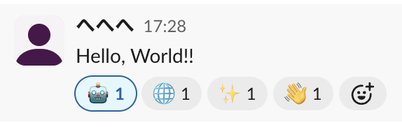

# stampy :robot:

生成AIでSlackのメッセージにリアクションを付けよう。

## 必要なもの

- Google Apps Script
    - [Apps Script](https://script.google.com/home) からプロジェクトを作成してください
- Gemini API Key
    - [Google AI Studio](https://aistudio.google.com/welcome) から取得してください
    - モデルは好きなの使ってください
- Slack API OAuth Token
    - [Slack API](https://api.slack.com/) から取得してください
    - Scope は `reactions:read` と `reactions:write` が必要です
- Slack API 検証トークン
    - [Slack API](https://api.slack.com/) の `Basic Information > App Credentials > Verification Token` から取得してください

※取得したAPIキーやトークンは「スクリプト プロパティ」に保存して使用してください。

## 使い方

※GASのデプロイ方法やAPIキーの取得、Slackアプリの設定などは省略します。  
チャンネルにアプリを追加した後、任意のメッセージに `:robot_face:` のリアクションを追加してください。  
画像のように最大で3つのスタンプが付与されます。

それだけ！！

## 参考情報

* [Gemini API のクイックスタート](https://ai.google.dev/gemini-api/docs/quickstart)
* [Gemini API で Gemma を実行する](https://ai.google.dev/gemma/docs/core/gemma_on_gemini_api?hl=ja)
* [slackのチャットボットの自動絵文字リアクション](https://developers.cyberagent.co.jp/blog/archives/45020/)
* [【Slack】Slack BotをSlack apiとGASを用いて作ってみよう！【GAS】](https://qiita.com/flowernotfound/items/318daa37b72558175b4a)
* [Google Apps Script (GAS) で Slack 連携を実装する前に知っておくとよい 5 つのこと](https://qiita.com/seratch/items/2158cb0abed5b8e12809)